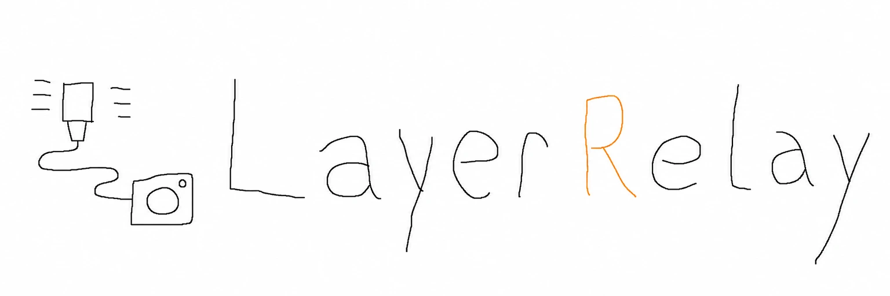
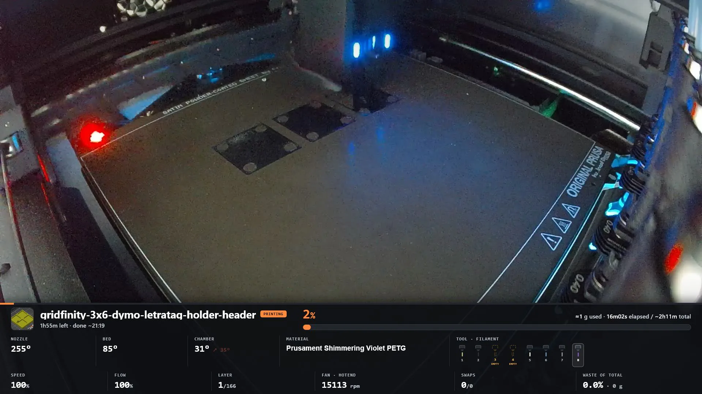
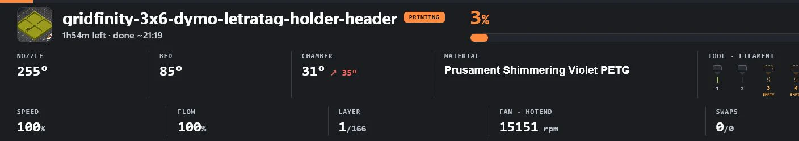

<p align="center">
  
</p>

# LayerRelay — Prusa printer monitoring dashboard

A self-hosted monitoring dashboard for Prusa printers, with an optional OBS
browser overlay. LayerRelay combines a printer camera feed, local PrusaLink
telemetry, recommended Prusa Connect telemetry, decoded `.bgcode` timelines,
and optional Netatmo room temperature. The same page can run as a normal browser
dashboard, a full 1080p OBS view, or a transparent lower-third overlay.

The project is developed against a **Prusa CORE One with an INDX toolchanger**.
Basic telemetry should be useful with other PrusaLink printers, but their state,
camera, and G-code behavior still needs community testing.

The printer integrations are display-only: they read printer APIs with `GET`
requests and have no pause, stop, movement, temperature, or upload controls.
The local dashboard can write only its own non-secret tool inventory.
That describes this project's behavior, not the authority of a Prusa web-client
refresh token, which may carry broader account permissions; see the
[Connect setup guide](docs/prusa-connect.md).

## Screenshots

<p align="center">
  <a href="docs/assets/dashboard-preview.webp">
    
  </a>
  <br><sub>Full 1920 × 1080 camera dashboard · click to open full size</sub>
</p>

<p align="center">
  <a href="docs/assets/overlay-preview.webp">
    
  </a>
  <br><sub>Camera-free telemetry overlay for OBS · click to open full size</sub>
</p>

## What it shows

- The printer camera, relayed from RTSP through one shared local MJPEG fanout
- Print name and thumbnail, lifecycle state, progress, remaining time, and finish clock
- Nozzle, bed, chamber, and room temperatures
- Active tool, configured spool name/colour, and the next tool change
- Automatic tool count and loaded/material inventory from Prusa Connect, with
  optional per-field dashboard overrides and locally cached OpenPrintTag suggestions
- Layer, speed, flow, hotend fan, tool-swap count, purge waste, and filament estimate
- Tool-change ticks on the progress bar, decoded from the active `.bgcode`
- Last-known values during a printer or cloud outage, visibly marked as stale/offline
- A persisted finished-job summary that survives an OBS browser refresh
- Non-print printer activity instead of a false READY/PRINTING state while the
  machine is calibrating, self-testing, homing, handling filament, or servicing itself

## Quick start

### Requirements

| Component | Required? | Expectation |
|---|---|---|
| Prusa printer | Yes | A network-reachable printer exposing PrusaLink, with a Digest username and password. v0.1.0 is developed and tested with a Prusa CORE One and INDX toolchanger. Other PrusaLink models and firmware combinations are not yet verified; no minimum firmware version is claimed. |
| Prusa Connect account | Recommended for CORE One/INDX | Supplies the exact active tool and richer live telemetry that PrusaLink lacks. The overlay falls back to PrusaLink when Connect is not configured or unavailable. |
| [Bun](https://bun.com/docs/installation) | Native installs | Bun 1.3.14 or newer in the supported 1.x line (`>=1.3.14 <2`). The Docker image includes Bun. |
| Camera | No | Integrated video requires a reachable `rtsp://` or `rtsps://` stream. Without one, telemetry and the transparent overlay still work and the camera relay remains off. |
| FFmpeg | Camera relay/snapshot only | Native installs need FFmpeg at `cameraFfmpegPath` or on `PATH` for the relay and snapshot helper. The Docker image includes FFmpeg. |
| OBS Studio | No | Needed only for an OBS Browser Source. No minimum OBS version is claimed. Use 1920 x 1080 for the full dashboard or 1920 x 420 for the camera-free lower third. A normal browser can display the dashboard without OBS. |
| Network access | Yes | The host must reach PrusaLink and, when enabled, the RTSP camera. Prusa Connect, optional Netatmo, the first use of OpenPrintTag suggestions, and catalog refreshes after the 24-hour cache TTL require outbound internet access. LayerRelay's fixed catalog requests never include picker text; searches run against its normalized local index. Manual tool editing remains usable without catalog access. |

Clone the repository and enter its directory first:

```sh
git clone https://github.com/GoByeBye/LayerRelay.git
cd LayerRelay
```

For complete CORE One/INDX telemetry, first capture a dedicated Prusa Connect
refresh token using the [Connect setup guide](docs/prusa-connect.md). You can
skip that step for a PrusaLink-only setup and add it later.

Use the same setup flow on Windows, macOS, and Linux:

```sh
bun ci
bun run setup
bun run doctor
bun run start
```

Setup creates the ignored `config.json` without overwriting an existing one. In
an interactive terminal it asks for the PrusaLink credentials, optional RTSP
URL, recommended Prusa Connect UUID and hidden refresh token, and an optional
manual tool-count override. Leave the count on `auto` to follow Connect.

Open <http://localhost:8787/> after startup. For a container install, use the
[Docker guide](docs/docker.md); Compose publishes the service on host loopback
by default.

Move the pointer to reveal **Dashboard**, then choose **Tools & filament**.
Tool count, loaded/empty state, and material follow Prusa Connect automatically
when that inventory is available. Count, presence, name, and colour can be
overridden independently; count, presence, and type can be returned to
**Auto** later, while **Auto type** preserves the selected colour. Changes take
effect without restarting the server. Filament suggestions are optional;
they search a normalized local suggestion index derived from the OpenPrintTag
material and brand snapshots. Custom names and colours remain usable before the
first successful refresh or whenever the cached index is unavailable.

## Configuration

`config.example.json` is the safe starting point, and `config.schema.json`
documents the complete configuration shape for editors and validation. At
minimum, set `printerHost`, `username`, and `password`.

The main settings are:

| Setting | Purpose |
|---|---|
| `listenHost` / `port` | Local HTTP listener. Keep `127.0.0.1` unless another machine must read the overlay. |
| `pollIntervalMs` | Local PrusaLink cadence. `2000` is the safe default for the printer's Buddy board. |
| `sourceCodeUrl` | Corresponding-source URL offered in the dashboard and HTTP `Link` header. Modified deployments must point it at their exact source. |
| `toolCount` / `toolSlots` | Optional inventory overrides. `toolCount: null` and omitted slot fields follow Prusa Connect; explicit dashboard values persist in `DATA_DIR/tool-settings.json`. |
| `toolSettingsAllowedOrigins` | Exact extra browser origins allowed to save tool settings through a named host or authenticated reverse proxy. Loopback and literal IP origins need no entry. |
| `localBgcodeDirs` | Folders searched for a matching `.bgcode` before downloading it from the printer. |
| `printNameOverrides` | Optional exact `jobKey` to display-name map for slicer files that expose only placeholders such as `Merged`. |
| `connect*` | Recommended but experimental Prusa Connect UUID, rotating refresh token, and rate-limited poll cadence. Complete credentials enable it by default; review the service-terms boundary in the [setup guide](docs/prusa-connect.md). |
| `netatmo*` | Optional station credentials and room-temperature poll cadence. |
| `cameraRtspUrl` | Server-side RTSP source for the shared camera relay and snapshot helper. Buddy3D's local URL contains no credential, but its feed is unprotected; the URL is never sent to the browser. |
| `cameraStreamEnabled` | Enables the relay. When omitted, a configured `cameraRtspUrl` enables it automatically; set `false` to disable it. |
| `cameraFfmpegPath` | FFmpeg executable name or path. Defaults to `ffmpeg` on `PATH`. |
| `cameraStreamFps` / `cameraStreamWidth` / `cameraStreamJpegQuality` | MJPEG frame rate, output width, and encoder quality. Defaults are `24`, `1920`, and `5`. |
| `cameraStreamThreads` | Decoder/filter/encoder thread cap. Defaults to `4`, avoiding FFmpeg's large auto-thread buffer footprint while sustaining 1080p24. |
| `cameraStreamKillGraceMs` | Grace period before a stuck FFmpeg worker is force-stopped. Defaults to `3000` ms. |
| `cameraStreamIdleMs` / `cameraStreamStallMs` | Delay before an unused relay stops and the no-frame watchdog restarts it. Defaults are `10000` and `20000` ms. |
| `analysisCacheMaxEntries` / `analysisCacheMaxBytes` | Retention limits for per-print analysis JSON. Defaults are 100 jobs and 64 MiB; camera frames are never stored there. |

Do not commit `config.json` or `cache/`: they contain credentials, rotating cloud
tokens, and live state. Both paths are gitignored and excluded from Docker builds.
Custom runtime locations and container environment overrides are documented in
[docs/configuration.md](docs/configuration.md).

## OBS setup

For a new integrated dashboard, add one **Browser** source with URL
`http://localhost:8787/`, Width **1920**, and Height **1080**. Enable **Refresh
browser when scene becomes active**. The server opens one upstream RTSP reader
and fans its MJPEG output out to every connected browser, so OBS refreshes or
multiple local previews do not create extra camera sessions.

### Migrating an active scene safely

If OBS already has a Media Source reading the RTSP URL directly, use this order:

1. Leave the existing Browser Source at **1920 × 420** while checking that its
   telemetry still works.
2. **Disable the old RTSP Media Source.** Do this before changing the Browser
   Source size.
3. Set the Browser Source URL to `http://localhost:8787/` and resize it to
   **1920 × 1080**.
4. Confirm that the integrated camera is live, then remove the disabled Media
   Source when convenient.

That order is important: resizing the Browser Source enables its integrated
camera, so disabling the old Media Source first ensures the camera never has two
upstream RTSP readers.

An existing **1920 × 420** Browser Source automatically remains the transparent,
camera-free lower third. `/overlay` and `/?camera=0` explicitly select that mode;
`/?camera=1` forces the camera on regardless of viewport height. The telemetry
card remains 250 px tall and anchored to the bottom, leaving transparent space
above it in a 420 px source.

Room temperature is hidden initially and is toggled independently in each
Browser Source through the dashboard controls. That preference is stored in the
browser profile. Use `?room=1` or `?room=0` to force it shown or hidden for a
specific source.

Optional query parameters:

- `?camera=1` forces the integrated camera; `?camera=0` forces transparent overlay mode.
- `?room=1` or `?room=0` overrides the per-browser room-temperature preference.
- `?controls=0` hides the auto-fading dashboard controls; `?controls=1` forces them on.

### Calibration and maintenance activity

Prusa firmware reports built-in calibration, self-test, preheat, cold-pull,
filament, and maintenance workflows through one coarse `BUSY` state. The overlay
therefore always detects that a non-print operation is active and shows a dedicated
activity card instead of `READY`. It uses a specific label only when an upstream
state, title, or operation field names the task; otherwise it honestly says
`Printer busy`. It never guesses a calibration type from temperatures or movement.

## How the tool and layer timeline works

PrusaLink does not expose the INDX active tool or swap count as an MMU. Prusa
Connect is therefore the recommended source for the exact active tool and richer
live telemetry; decoded `.bgcode` remains the source for swap, layer, and waste
timelines. For each new job, the server obtains the `.bgcode` from the first
applicable source:

1. A matching analysis in `cache/`
2. A matching file in `localBgcodeDirs`
3. An authenticated Prusa Connect download or a printer download, depending on
   which matching remote descriptor is available for that job

`bgcode.js` decodes the container in pure JavaScript (Heatshrink + MeatPack), and
`toolswaps.js` builds progress-to-tool, swap, layer, remaining-time, and purge
timelines. Results are cached by job and decoder version. Local copies are best
for the Buddy board because a printer download can be slow during a busy print.

G-code tools are 0-based (`T0`-`T7`); the API keeps `currentTool` 0-based while
`toolLabel` and configured `toolSlots` use the printer UI's 1-based labels.

Purge waste is the extrusion inside PrusaSlicer's `FLUSH` and `EXCLUDE_E` blocks,
converted to grams using the file's filament diameter and density. The live
filament readout is explicitly marked as an estimate because print progress is
not an extrusion timeline.

## Runtime and API

| File | Role |
|---|---|
| `server.js` | Poll orchestration, state merging, persistence, HTTP API, and static files |
| `camera-stream.js` | One-upstream RTSP-to-MJPEG relay, client fanout, and FFmpeg lifecycle |
| `digest.js` | PrusaLink HTTP Digest client |
| `prusaconnect.js` | Recommended Prusa Connect OAuth and telemetry mapping |
| `netatmo.js` | Optional Netatmo OAuth and station mapping |
| `bgcode.js` | `.bgcode` container and G-code decoder |
| `toolswaps.js` | Tool/swap/layer/waste timeline builder |
| `tool-settings.js` | Validated, immediately applied tool inventory persisted under `DATA_DIR` |
| `filament-catalog.js` | Persistent local suggestion index derived from the public OpenPrintTag material and brand snapshots |
| `public/overlay.html` | Self-contained overlay UI; browser requests remain same-origin |
| `tools/` | Guarded restart, camera snapshot, and Connect token-display helpers |

HTTP endpoints:

- `GET /healthz` — process liveness only; printer and camera outages do not fail it
- `GET /source` — redirects to the configured corresponding source for the running deployment
- `GET /api/state` — merged live state, connectivity, tool inventory, and completed job
- `GET /api/settings/tools` — non-secret override, detected, and effective tool inventory layers
- `PUT /api/settings/tools` — same-origin JSON update for only nullable count and per-field overrides
- `GET /api/filaments?q=<text>` — optional cached filament suggestions; custom values never depend on it
- `GET /api/camera.mjpeg` — long-lived shared MJPEG printer-camera stream
- `GET /api/camera.jpg` — latest complete camera frame as a single JPEG
- `GET /api/camera/status` — camera relay state, viewer count, frame age, configured/measured FPS, JPEG byte rate, restart timing, and credential-safe errors
- `GET /api/jobmap` — swap tick percentages for the active analyzed job
- `GET /api/thumbnail?j=<jobKey>` — thumbnail guarded against cross-job reuse

Keep `listenHost` at `127.0.0.1` for a local OBS setup. Binding to a LAN address
makes the dashboard and read APIs—including the live camera relay—reachable by
other hosts. Restrict the port with the host firewall or an authenticated reverse
proxy. The RTSP URL remains server-side, but the relayed images are still
sensitive.

## Resilience

- Poll loops self-schedule and back off instead of stacking intervals.
- Local telemetry remains authoritative when Prusa Connect is unavailable.
- Last state, completed job, analysis, and rotating OAuth tokens are written
  atomically and can recover from a backup.
- A disconnected overlay keeps the last-known frame visible and freezes countdowns.
- Analysis and thumbnail failures back off; a late analysis from an old job is not
  allowed to replace the current job.
- Camera viewers share one FFmpeg/RTSP upstream. The relay starts on demand, drops
  frames for slow clients instead of buffering without bound, and retries a lost
  camera connection with backoff.
- Camera JPEGs remain in RAM only: FFmpeg writes to stdout, the relay keeps one latest
  frame, browsers receive `no-store`, and no recording or frame cache is created.
- Per-print analysis JSON is pruned by count and total size.
- `tools/restart-overlay.ps1` preflights the Bun checks, tests, and isolated smoke
  test before stopping only the server on the configured port. It then waits for
  the port to clear, starts one hidden process, and verifies `/api/state`.

## Operations

```powershell
pwsh tools/restart-overlay.ps1
bun tools/snapshot.mjs C:\tmp\printer.jpg
```

The restart helper is Windows-specific; container users should run
`docker compose restart overlay`. See `tools/README.md` for snapshot, restart,
and platform notes.

The optional `.agents/skills/` files are intentionally public, credential-free
Codex command wrappers for the safe restart and camera-snapshot workflows. They
delegate to the documented tools and are excluded from Docker builds.

## Verification

```sh
bun run check
bun test
bun run smoke
bun run doctor -- --require-running
```

The test suite covers camera fanout/backpressure/recovery, dashboard mode and room
preferences, material metadata, tool/layer/purge timeline mapping, persistence,
request deadlines, telemetry freshness, and Prusa Connect's telemetry and
authenticated asset boundaries.

## Contributing, security, and licensing

See [CONTRIBUTING.md](CONTRIBUTING.md) before submitting changes and
[SECURITY.md](SECURITY.md) for private vulnerability reports.

The repository is licensed under the
[GNU Affero General Public License v3 or later](LICENSE). `bgcode.js` includes a
JavaScript port of [Prusa's libbgcode](https://github.com/prusa3d/libbgcode);
[NOTICE.md](NOTICE.md) records the pinned provenance, dated modifications, and
the full MeatPack and heatshrink notices. It also contains the project's
[AI-assisted development disclosure](NOTICE.md#ai-assisted-development).

Remote users can open **Source & AGPL license** from the dashboard controls or
visit `GET /source`. Modified deployments must set
`sourceCodeUrl` or `SOURCE_CODE_URL` to the corresponding source for that exact
version; Docker deployments use `SOURCE_CODE_URL`, which takes precedence over
the mounted JSON configuration. Package-registry publication remains disabled
with `private: true`; supported installation paths are a Git checkout or Docker.
